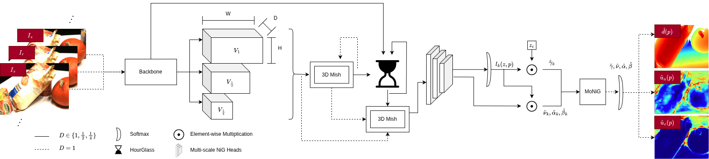

# EMVSNet

Code release for EMVSNet (evidential multi-view stereo), with training, depth inference, uncertainty estimation, and depth-map fusion.

---

> **News:** The EMVSNet paper has been accepted for the ISPRS 2026 Toronto Congress.

---

This repository includes:

- core model/training code (`train.py`, `models/`)
- inference and uncertainty export (`eval.py`, `evaluation/`)
- depth map fusion to point clouds (`fusion.py`, `fusion_padding.py`)
- optional Docker workflows for reproducible/cloud runs



## Quick Start (Local)

### 1) Environment

```bash
conda create -n emvsnet python=3.9 -y
conda activate emvsnet
pip install --upgrade pip
pip install -r requirements.txt
```

### 2) Dataset path

Set your DTU root once (expected structure: `$TRAINPATH/<scan folders>` from the DTU preprocessing used by this repo):

```bash
export TRAINPATH=/path/to/mvs_training/dtu
```

You can also edit `env.sh` and reuse shell scripts from `scripts/`.

### 3) Train (single GPU)

```bash
python train.py \
  --dataset dtu_yao \
  --trainpath "$TRAINPATH" \
  --trainlist lists/dtu/train.txt \
  --vallist lists/dtu/val.txt \
  --testlist lists/dtu/test.txt \
  --batch_size 1 \
  --epochs 1 \
  --view_num 5 \
  --numdepth 128 \
  --interval_scale 1.06 \
  --image_scale 0.25 \
  --lr 0.001 \
  --optimizer adam \
  --evidential_method der \
  --logdir ./checkpoints/quickstart
```

### 4) Evaluate depth + uncertainty maps

```bash
python eval.py \
  --dataset data_eval_transform \
  --testpath "$TRAINPATH" \
  --testlist lists/dtu/test.txt \
  --batch_size 1 \
  --numdepth 256 \
  --interval_scale 1.0 \
  --image_scale 1.0 \
  --view_num 7 \
  --loadckpt /path/to/model.ckpt \
  --outdir ./outputs_dtu \
  --evidential_method der
```

### 5) Fuse depth maps to point cloud

```bash
python fusion.py \
  --testpath "$TRAINPATH" \
  --testlist lists/dtu/test.txt \
  --outdir ./outputs_dtu \
  --test_dataset dtu
```

## Optional: Docker Workflow

Use Docker if you want a reproducible runtime or cloud deployment. Local setup above remains the recommended development path.

### Build

```bash
docker build -t emvsnet:latest .
```

### Run (single command)

Host data directory should be mounted to `/workspace/data`, with DTU at `/workspace/data/mvs_training/dtu`.

```bash
docker run --gpus all --rm -it \
  -v /path/to/host_data:/workspace/data:ro \
  -v /path/to/host_output:/workspace/output \
  emvsnet:latest \
  python train.py \
    --dataset dtu_yao \
    --trainpath /workspace/data/mvs_training/dtu \
    --trainlist lists/dtu/train.txt \
    --vallist lists/dtu/val.txt \
    --testlist lists/dtu/test.txt \
    --batch_size 1 \
    --epochs 1 \
    --view_num 5 \
    --numdepth 128 \
    --interval_scale 1.06 \
    --image_scale 0.25 \
    --lr 0.001 \
    --optimizer adam \
    --evidential_method der \
    --logdir /workspace/output/checkpoints/quickstart
```

### Docker Compose

```bash
cp docker.env.example docker.env
# edit docker.env (HOST_DATA_PATH and OUTPUT_PATH)
docker compose up -d
docker compose logs -f
```

## Repository Commands

Helpful script entry points:

- `scripts/train_dtu.sh`
- `scripts/train_dtu_ddp.sh`
- `scripts/eval_dtu.sh`
- `scripts/fusion_dtu.sh`
- `scripts/eval_tnt.sh`
- `scripts/fusion_tnt.sh`

## Citation

Please cite the EMVSNet paper if you use this codebase:

```bibtex
@inproceedings{emvsnet2026,
  title={EMVSNet},
  author={TODO},
  booktitle={TODO},
  year={2026}
}
```

## Acknowledgements

This project builds on [AA-RMVSNet](https://github.com/qt-zhu/aa-rmvsnet) and its open-source PyTorch implementation.  
Our evidential uncertainty components are also inspired in part by [ELFNet](https://github.com/jimmy19991222/ELFNet).  
We thank the original authors and maintainers for making their work publicly available.

## License

Released under the MIT License. See `LICENSE`.
